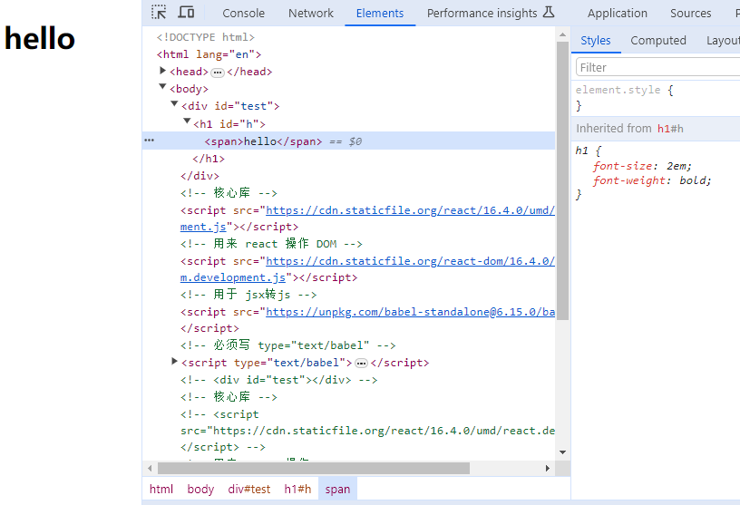
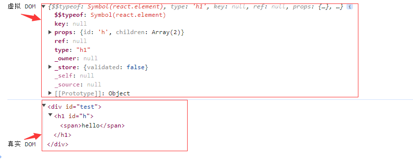
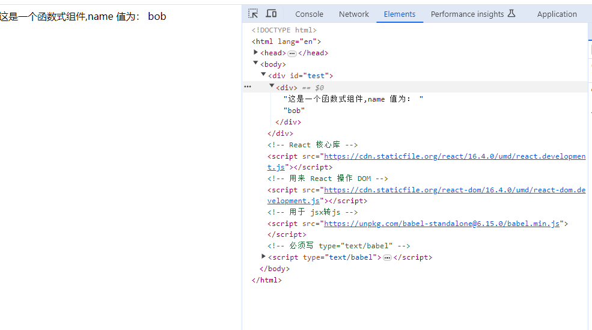

# React
> 以下是观看 [尚硅谷React课程](https://www.bilibili.com/video/BV1wy4y1D7JT?p=43&t=5) 所做的笔记。


## 01-react（简介）

**1、react是什么？**

用于构建用户界面的 `JavaScript` 库（是一个将数据渲染为HTML视图的开源 `JavaScript` 库）

**2、谁开发的**

Facebook 开发、开源


**3、为什么用**

- 原生 `JavaScript` 操作 `DOM` 繁琐且效率低
- 使用 `JavaScript` 直接操作 `DOM`，浏览器会进行大量的重绘重排
- 原生 `JavaScript` 没有组件化编程方案，代码复用率低

**4、特点**

- 采用组件化模式、声明式编码，提高开发效率及组件复用率。
- 在 `React Native` 中可以使用 `React` 语法进行移动端开发
- 使用虚拟 `DOM+Diff` 算法，进行减少与真实 `DOM` 的交互

## 02-react（hello案例）

**1、案例中用到的 `JS` 包**

```text
react-dom.js   用于支持 React 操作  DOM
babel.min.js   用于将  jsx 转为 js
react.js       React 核心库
```

**2、案例**

```html
<!DOCTYPE html>
<html lang="en">
<head>
  <meta charset="UTF-8">
  <meta http-equiv="X-UA-Compatible" content="IE=edge">
  <meta name="viewport" content="width=device-width, initial-scale=1.0">
  <title>React</title>
</head>
<body>
  <!--第一步：先准备一个容器--->
  <div id="test"></div>


  <!--第二步:导入必要的 js 库-->
  <!-- React 核心库 -->
  <script src="https://cdn.staticfile.org/react/16.4.0/umd/react.development.js"></script>
  <!-- 用来 React 操作 DOM -->
  <script src="https://cdn.staticfile.org/react-dom/16.4.0/umd/react-dom.development.js"></script>
  <!-- 用于 jsx转js -->
  <script src="https://unpkg.com/babel-standalone@6.15.0/babel.min.js"></script>
  


  <!-- 第三步：创建虚拟DOM & 渲染到界面 -->
  <!-- 必须写 type="text/babel"，用于解析 JSX语法 -->
  <script type="text/babel">
    const VDOM = <h1 id="h"> <span>hello</span></h1> // 创建虚拟DOM
    ReactDOM.render(VDOM, document.getElementById('test')) // 渲染到界面
  </script>
</body>
</html>
```

**3、案例运行效果**




## 03-react（创建虚拟DOM的两种方式）

- 方式1：使用 `JSX`（常用）

```html
<!DOCTYPE html>
<html lang="en">
<head>
  <meta charset="UTF-8">
  <meta http-equiv="X-UA-Compatible" content="IE=edge">
  <meta name="viewport" content="width=device-width, initial-scale=1.0">
  <title>React</title>
</head>
<body>
  <!--第一步：先准备一个容器--->
  <div id="test"></div>


  <!--第二步:导入必要的 js 库-->
  <!-- React 核心库 -->
  <script src="https://cdn.staticfile.org/react/16.4.0/umd/react.development.js"></script>
  <!-- 用来 React 操作 DOM -->
  <script src="https://cdn.staticfile.org/react-dom/16.4.0/umd/react-dom.development.js"></script>
  <!-- 用于 jsx转js -->
  <script src="https://unpkg.com/babel-standalone@6.15.0/babel.min.js"></script>
  


  <!-- 第三步：创建虚拟DOM & 渲染到界面 -->
  <!-- 必须写 type="text/babel"，用于解析 JSX语法 -->
  <script type="text/babel">
    const VDOM = <h1 id="h"> <span>hello</span></h1> // 使用 JSX 方式 创建虚拟DOM
    ReactDOM.render(VDOM, document.getElementById('test')) // 渲染到界面
  </script>
</body>
</html>
```

- 方式2：使用 `React.createElement(component，props，children)`

```html
<!DOCTYPE html>
<html lang="en">
<head>
  <meta charset="UTF-8">
  <meta http-equiv="X-UA-Compatible" content="IE=edge">
  <meta name="viewport" content="width=device-width, initial-scale=1.0">
  <title>React</title>
</head>
<body>
  <!--第一步：先准备一个容器--->
  <div id="test"></div>


  <!--第二步:导入必要的 js 库-->
  <!-- React 核心库 -->
  <script src="https://cdn.staticfile.org/react/16.4.0/umd/react.development.js"></script>
  <!-- 用来 React 操作 DOM -->
  <script src="https://cdn.staticfile.org/react-dom/16.4.0/umd/react-dom.development.js"></script>
  


  <!-- 第三步：创建虚拟DOM & 渲染到界面 -->
  <script type="text/javascript">
     // 使用 React.createElement 方式来创建虚拟DOM
    const VDOM = React.createElement('h1', {id: 'h'}, React.createElement('span', {}, 'hello') )
    ReactDOM.render(VDOM, document.getElementById('test')) // 渲染到界面
  </script>
</body>
</html>
```


## 04-react（虚拟DOM&真实DOM）

- 虚拟 `DOM` 本质是 `Object` 类型的对象（一般对象）
- 虚拟 ` DOM` 比较轻，真实DOM比较重。因为虚拟 `DOM` 是 `React` 内部用，无需真实DOM上那么多属性
- 虚拟DOM最终会被 `React` 转换为真实DOM呈现在页面上




## 05-react（JSX 语法）

**1、JSX 简介**

- 全称 `javascript XML`
- `React` 定义的一种类似于XML的JS扩展语法: `JS+XML`,最终产生一个 `JS` 对象
- 不是字符串，也不是 `HTML`|| `XML` 标签
- 本质上是 `React.createElement(componet，props, children)` 的语法糖， 用来简化创建虚拟 `DOM`
- 写法：`const VDOM = <span>Info</span>`

**2、JSX 语法限制**

- 标签名任意，可以是HTML或者自定义标签
- 定义虚拟 `DOM`，不要写引号，多行可使用()括起来，里面可以进行换行
- 标签中混入JS表达式，需要使用 {}
- 样式的类名指定不要用 `class`, 要使用 `className`
- 内联样式，要用 `style={{属性：值}}` 这样的形式
- 只有一个根标签
- 标签必须闭合
- 标签首字母如果是小写开头，则将该标签转为 `HTML` 同名元素，如果 `HTML` 中没有该标签对应的同名元素，则报错
- 标签首字母如果大写开头，`React` 就去渲染对应的组件。如果组件没有定义，则报错

**3、代码示例**

```html
<!DOCTYPE html>
<html lang="en">
<head>
  <meta charset="UTF-8">
  <meta http-equiv="X-UA-Compatible" content="IE=edge">
  <meta name="viewport" content="width=device-width, initial-scale=1.0">
  <title>React</title>
  <style>
    .c1{
        color: red;
    }
</style>
</head>
<body>
  <div id="test"></div>
  <!-- React 核心库 -->
  <script src="https://cdn.staticfile.org/react/16.4.0/umd/react.development.js"></script>
  <!-- 用来 React 操作 DOM -->
  <script src="https://cdn.staticfile.org/react-dom/16.4.0/umd/react-dom.development.js"></script>
  <!-- 用于 jsx转js -->
  <script src="https://unpkg.com/babel-standalone@6.15.0/babel.min.js"></script>
  
  <!-- 必须写 type="text/babel" -->
  <script type="text/babel">
   const MyId = "MyId";
    const myData = "HaHa,Hi";
    const data =[1, 2, 3, 'React', 'Vue', 'JS', [1,2, 3]];

    // 1.创建虚拟DOM[在这使用了js的语法]React.createElement(标签,标签属性,内容)
    const VDOM = (
            <div id = {MyId.toLocaleUpperCase()}>
                <p className = "c1" style = {{fontSize:'50px'}}>{myData.toLocaleUpperCase()}</p>   
                
                {
                  // 报错：如果小写字母开头，就将标签转化为html同名元素，如果html中无该标签对应的元素，就报错
                  // <good>1122</good>
                  // 报错：如果是大写字母开头，react就去渲染对应的组件，如果没有就报错
                  // <Good>1122</Good>
                }


                <ul>
                    { // {} 里面只能放表达式
                        //如果渲染的是一个列表，每一行必须要有一个key
                        data.map((item,index)=>{
                            return <li key = {index}>{item}</li>
                        })
                    }
                </ul>  
            </div>
        )
        // 2.渲染，如果有多个渲染同一个容器，后面的会将前面的覆盖掉
        ReactDOM.render(VDOM, document.getElementById('test')) // 渲染到界面


         /*
        JS表达式：返回一个值，可以放在任何一个需要值的地方  a  a+b  demo(a)  arr.map() function text(){}
        JS语句：if(){} for(){} while(){} swith(){} 不会返回一个值
        */

        //1.定义虚拟DOM，不能使用“”
        //2.标签中混入JS表达式的时候使用{}
        //3.样式的类名指定不要使用class，使用className
        //4.内敛样式要使用style={{样式:"值"}}
        //5.不能有多个根标签，只能有一个跟标签
        //6.标签必须闭合
        //7.如果小写字母开头，就将标签转化为html同名元素，如果html中无该标签对应的元素，就报错
        // 如果是大写字母开头，react就去渲染对应的组件，如果没有就报错
  </script>
</body>
</html>
```

**4、扩展（JS表达式 vs JS语句）**
- `JS` 表达式：返回一个值，可以放在任何一个需要值的地方  

```bash
a  
a+b  
demo(a)  
arr.map() 
function text(){}
```

- `JS` 语句：不会返回一个值

```bash
if(){} 
for(){} 
while(){} 
swith(){} 
```

## 06- react(模块与组件啊、模块化与组件化)

**1、模块**

- 理解：向外提供特定功能的 `JS` 程序，一般是一个 `JS` 文件
- 为什么要拆成模块：随着业务逻辑的增加，代码越来越多且复杂
- 作用：复用 `JS`，简化 `JS` 的编写，提高 `JS` 的运行效率

**2、组件**

- 理解：用来实现局部功能效果的代码及资源的集合（`html+css+js+image`等）
- 为什么要组件化：实际业务开发时，一个界面功能通常很复杂
- 作用：复用编码，简化代码的编程，提高效率

**3、模块化**

- 当应用的 `JS` 都以模块来编写，这个应用就是一个模块化的一个用

**4、组件化**

- 当应用是以多组件的方式实现，这个应用就是一个组件化的应用

**5、react 开发者工具**
浏览器扩展工具加入此工具

## 07- react(函数式组件)

**1、React 组件分类**
- 函数式组件
- 类组件

**2、函数式组件**
- 函数式组件定义名称时，注意名首字母大写
- `React` 会将以小写字母开头的组件视为原生 `DOM` 标签。例如，< div />` 代表 HTML 的 div 标签，而 `< Weclome /> 则代表一个组件，并且需在作用域内使用 `Welcome`
- 传递的参数，不能在组件中改动

**3、代码示例**
- 下面示例中发生了什么？
  - 我们调用 `ReactDOM.render()` 函数，传入 `<Welcome name="bob" />` 
  -  `React` 解析组件标签，找到组件 `Welcome`
  - 发现组件时函数定义的，然后调用函数，并将 `{name: 'bob'}` 作为 `props` 传入
  - `Welcome` 组件将 `Hello, bob` 元素作为返回值
  - `React DOM` 将返回的虚拟 `DOM` 转为 真实 `DOM`，最后呈现在页面上

```html
<!DOCTYPE html>
<html lang="en">
<head>
  <meta charset="UTF-8">
  <meta http-equiv="X-UA-Compatible" content="IE=edge">
  <meta name="viewport" content="width=device-width, initial-scale=1.0">
  <title>React</title>
</head>
<body>
  <div id="test"></div>
  <!-- React 核心库 -->
  <script src="https://cdn.staticfile.org/react/16.4.0/umd/react.development.js"></script>
  <!-- 用来 React 操作 DOM -->
  <script src="https://cdn.staticfile.org/react-dom/16.4.0/umd/react-dom.development.js"></script>
  <!-- 用于 jsx转js -->
  <script src="https://unpkg.com/babel-standalone@6.15.0/babel.min.js"></script>
  
  <!-- 必须写 type="text/babel" -->
  <script type="text/babel">
   // 创建函数式组件
   function Welcome(props) {
    return <div>这是一个函数式组件,name 值为： {props.name}</div>
   }
   // 渲染组件到页面
   ReactDOM.render(<Welcome name="bob" />, document.getElementById('test'))

  //  执行 ReactDOM.render(<Welcome/>, document.getElementById('test'))发生了什么：
   //  React 解析组件标签，找到组件 Welcome
   // 发现组件时函数定义的，传入 name="bob" 属性
   // 最后调用函数，将返回的虚拟 DOM 转为 真实DOM，最后呈现在页面上
  </script>
</body>
</html>
```



## 08- react(类组件)

**1、类组件定义注意事项**

- 必须继承 `React.Component`
- 然后重写 `Render()` 方法，该方法一定要有返回值，返回一个虚拟 `DOM`

**2、类上的 `render` 方法放在哪里**
放在组件的原型对象上，供实例使用

**3、下面的代码示例中，执行` ReactDOM.render(<Welcome name="bob" />, document.getElementById('test'))` 发生了什么？**

- `React` 解析组件标签，找到了 `Welcome` 组件
- 发现组件时使用类定义的，随后 `new` 出来该组件的实例，并通过该实例调用原型上的 `render` 方法
- 将 `render` 方法返回的虚拟 `DOM` 转为真实 `DOM` ，最后呈现在页面上

**4、代码示例**
```html
<!DOCTYPE html>
<html lang="en">
<head>
  <meta charset="UTF-8">
  <meta http-equiv="X-UA-Compatible" content="IE=edge">
  <meta name="viewport" content="width=device-width, initial-scale=1.0">
  <title>React</title>
</head>
<body>
  <div id="test"></div>
  <!-- React 核心库 -->
  <script src="https://cdn.staticfile.org/react/16.4.0/umd/react.development.js"></script>
  <!-- 用来 React 操作 DOM -->
  <script src="https://cdn.staticfile.org/react-dom/16.4.0/umd/react-dom.development.js"></script>
  <!-- 用于 jsx转js -->
  <script src="https://unpkg.com/babel-standalone@6.15.0/babel.min.js"></script>
  
  <!-- 必须写 type="text/babel" -->
  <script type="text/babel">
   // 创建类组件
   //必须继承React.Component
  //然后重写Render()方法，该方法一定要有返回值，返回一个虚拟DOM
   class Welcome extends React.Component {

    render() {// render 放在哪里---Welcome的原型对象上，供实例使用
      // this指的是Welcome的实例对象，即：Welcome组件实例对象
      return <div>这是一个函数式组件,name 值为： {this.props.name}</div>
    }
   }
   // 渲染组件到页面
   ReactDOM.render(<Welcome name="bob" />, document.getElementById('test'))

   /*
   执行 ReactDOM.render(<Welcome name="bob" />, document.getElementById('test')) 发生了什么？

   React 解析组件标签，找到了 Welcome 组件
   发现组件时使用类定义的，随后 new 出来该组件的实例，并通过该实例调用原型上的 render 方法
   将 render 方法返回的虚拟 DOM 转为真实 DOM，最后呈现在页面上
   */
  </script>
</body>
</html>
```


**5、组件可以嵌套使用**

> 通过下面的示例，我们发现组件是可以包含中使用的。如果创建的是数组，必须要带一个 `key` 。数组元素中使用的 `key` 在其兄弟节点之间应该是独一无二的。然而，它们不需要是全局唯一的。当我们生成两个不同的数组时，我们可以使用相同的 `key` 值
```react
<script type="text/babel">
  //创建一个函数组件 <li>
  function GetLi(props){      
    return <li>{props.value}</li>
  }

  // 创建类式组件<ul>
  class MyComponent extends React.Component{
    render(){
      //这里包含了GetLi组件，注意不能用{}；这里渲染的是列表，故必须传递一个key, 来识别哪些元素被改变了（添加或删除）
      let com = this.props.arr.map((item,index)=> <GetLi value={item} key = {index} /> )
      return <ul>{com}</ul>
    }
  }
  
  let num = [1,2,3,4]
  //2.渲染组件
  ReactDOM.render(<MyComponent  arr={num}/>,document.getElementById("test");
</script>

```

**6、简单组件 vs 复杂组件**
- 简单组件： 无状态（state）组件
- 复杂组件： 有状态（state）组件
## 09- react(组件实例的三大核心属性之1-state)

1、理解
- `state` 是组件对象最重要的属性，值是对象（多个 `key-value` 的组合 ）
- 组件被称为“状态机”，体现是什么地方?，就是体现在state上
- 通过更新组件的 `state` 来更新对应的页面显示（重新渲染组件）
- `state` 是组件的私有属性


2、注意
- 组件的构造函数，必须要传递一个props参数
- 组件中的 render 方法中的 this 为组件实例对象
- 特别关注this【重点】，类中所有的方法局部都开启了严格模式，如果直接进行调用，this就是undefined
- 组件自定义的方法中的 this 为 undefined，可以通过对象的 bind() 方法强制绑定 this，也可以使用箭头函数
- 状态数据不能直接修改

## 10- react(组件实例的三大核心属性之2-state)
## 11- react(组件实例的三大核心属性之3-state)
## 12- react()
## 12- react()
## 12- react()
## 12- react()
## 12- react()
## 12- react()
## 12- react()
## 12- react()


